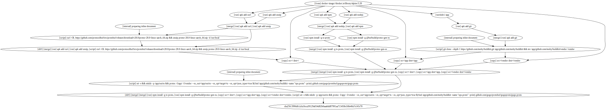

# dacc: docker-as-code compiler

#### _Cache-efficient, sandboxed, builds as code._

* <ins>Native</ins> support with any Docker installation, no extra tools needed
* <ins>Infrastructure-as-code</ins> for docker images
* <ins>Cache-efficient</ins>: Represent any build graph in dacc
* <ins>Extend</ins>: [__merge__](examples/merge.ts), [__diff__](examples/diff.ts), and [__nested builds__](examples/nested-builds.ts) operations


*A very parallel build [(src)](./packages/dacc/src/build/df.ts) generated with dacc*

### Installation
__dacc__ requires [Docker](https://www.docker.com).
```
npm install dacc
```
### Getting Started - Hello World
Create a new project with the `create-dacc`, which will create a new TypeScript project and install dacc in the directory provided.
```
npx create-dacc hello-dacc
```
Enter the newly created directory and run the build
```
cd hello-dacc && npm start
```


## Examples
- [Merging / Parallism](#merging--parallelism)
- [Diff Layers](./examples/src/diff.ts)
- [Generating protobuf definitions for this repository](./packages/dacc/src/build/df.ts)
- [Building the Buildkit Frontend Image](https://github.com/r2d4/llb/blob/main/build/src/main.ts)
- [Multi-platform](./examples/src/multi-platform.ts)
- [Nested builds](./examples/src/nested-builds.ts)
- [Directory of additional examples](./examples)

### Merging / Parallelism
Docker images often have to install packages via a package manager. This might be specified in a single command `RUN apk add git curl wget`. But when a new package is added, the entire cache is invalidated.

Instead, with dacc, you can install them in parallel and then merge the resulting filesystems. Adding or removing packages from the list won't invalidate the cache for the other packages.

```typescript main.ts
import { cacheMount, State } from 'dacc'

async function main() {
    const s = (await new State().from("alpine"))

    const bins = ["git", "curl", "wget"]

    s.merge(
        s.parallel(
            ...bins.map(bin => (s: State) =>
                s.run(`apk add ${bin}`).with(cacheMount("/var/cache/apk")))
        ),
    )

    s.image.run({
        run: { command: "ls", args: bins.map(bin => `/usr/bin/${bin}`) },
    })
}

void main()
```